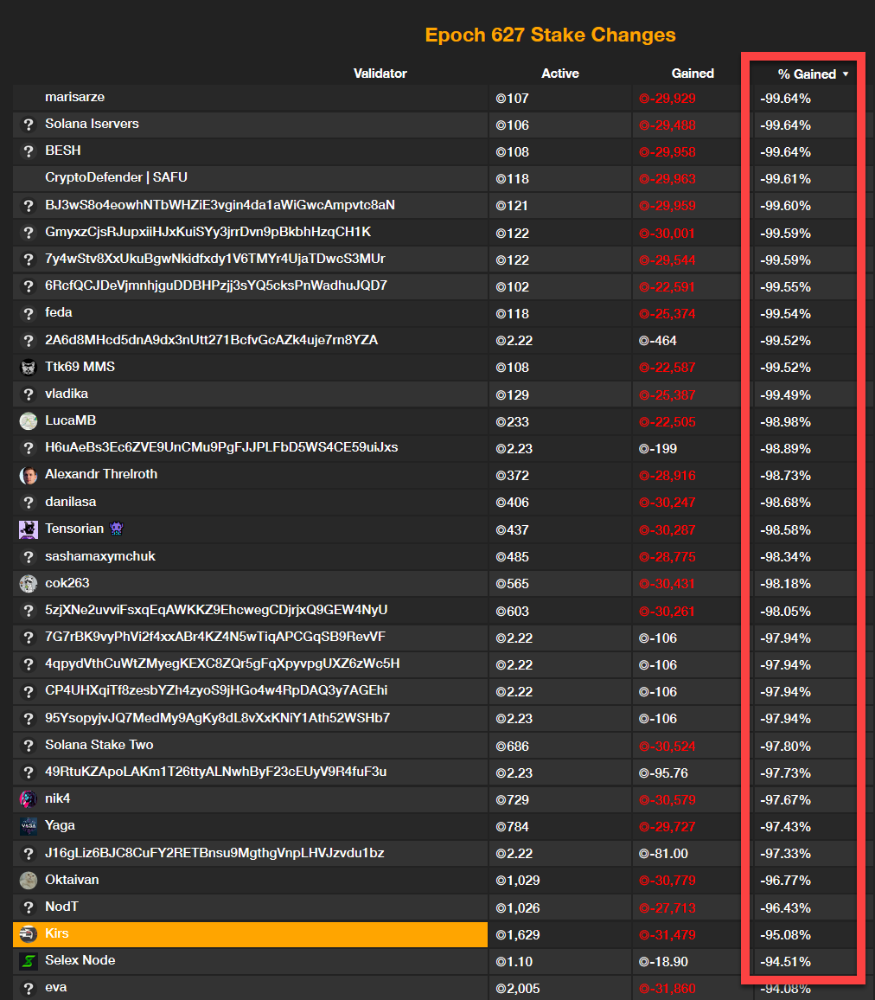

# a) You are aware of Jito's modified Solana client to improve the efficiency of MEV extraction. Describe how unaligned validators can run their own private mempool to facilitate sandwich attacks.
Unaligned validators can run their own private mempool to facilitate sandwich attacks by creating a separate, unobservable transaction pool. This allows them to monitor and manipulate transactions before they are included in the public mempool. Here's how they can do it:
1. Private Mempool Setup: The validator sets up a private mempool that is not connected to the public network. This private mempool is only accessible to the validator and their trusted nodes.
2. Transaction Monitoring: The validator monitors the private mempool for transactions that can be exploited for sandwich attacks. These typically involve high-value trades on decentralized exchanges (DEXs).
3. Front-Running and Back-Running: Once a vulnerable transaction is identified, the validator executes a front-running transaction (buying the asset before the victim's transaction) and a back-running transaction (selling the asset after the victim's transaction) to profit from the price movement.
4. Block Production: The validator then includes these transactions in the blocks they produce, ensuring that the sandwich attack is executed before the victim's transaction is processed.

# b) Identify the validators that had their stake removed, and determine the total amount removed.
</img>

# c) Write code that, given a Solana block, outputs whether a sandwich attack was included.
```python
from solana.rpc.api import Client
from solana.blockhash import Blockhash
from solana.transaction import TransactionInstruction
from solana.system_program import decode_instruction
from solana.token_program import decode_transfer_instruction

def is_sandwich_attack(transactions):
    """Detects if a sandwich attack is present in a list of transactions."""
    for i in range(1, len(transactions) - 1):
        tx_prev = transactions[i - 1]
        tx = transactions[i]
        tx_next = transactions[i + 1]
        
        # Check if the sequence matches a sandwich pattern
        if is_front_running(tx_prev, tx) and is_back_running(tx, tx_next):
            return True
    return False

def is_front_running(tx_prev, tx):
    """
    Checks if tx_prev is likely front-running tx.
    Returns True if tx_prev is increasing its position in an asset just before tx.
    """
    # Extract instruction data
    prev_instructions = tx_prev['transaction']['message']['instructions']
    victim_instructions = tx['transaction']['message']['instructions']
    
    for prev_instruction in prev_instructions:
        for victim_instruction in victim_instructions:
            if is_buy_order(prev_instruction) and affects_same_asset(prev_instruction, victim_instruction):
                return True
    return False

def is_back_running(tx, tx_next):
    """
    Checks if tx_next is likely back-running tx.
    Returns True if tx_next is decreasing its position in an asset just after tx.
    """
    # Extract instruction data
    victim_instructions = tx['transaction']['message']['instructions']
    next_instructions = tx_next['transaction']['message']['instructions']
    
    for victim_instruction in victim_instructions:
        for next_instruction in next_instructions:
            if is_sell_order(next_instruction) and affects_same_asset(victim_instruction, next_instruction):
                return True
    return False

def is_buy_order(instruction):
    """
    Determines if the instruction is a buy order.
    """
    # Decode the instruction to determine its type
    decoded = decode_instruction(instruction)
    return decoded['type'] == 'buy'

def is_sell_order(instruction):
    """
    Determines if the instruction is a sell order.
    """
    # Decode the instruction to determine its type
    decoded = decode_instruction(instruction)
    return decoded['type'] == 'sell'

def affects_same_asset(instruction1, instruction2):
    """
    Checks if both instructions affect the same asset.
    """
    asset1 = extract_asset_from_instruction(instruction1)
    asset2 = extract_asset_from_instruction(instruction2)
    return asset1 == asset2

def extract_asset_from_instruction(instruction):
    """
    Extracts the asset (e.g., token mint) involved in the instruction.
    """
    # Decode the instruction to extract the asset details
    decoded = decode_instruction(instruction)
    return decoded['asset']

def decode_instruction(instruction):
    """
    Decodes the instruction to determine its type and involved asset.
    """
    program_id = instruction['programId']
    data = instruction['data']
    accounts = instruction['accounts']
    if program_id == '11111111111111111111111111111111':  # System Program
        decoded = decode_system_instruction(Instruction(program_id, data, accounts))
    elif program_id == 'TokenkegQfeZyiNwAJbNbGKPFXCWuBvf9Ss623VQ5DA':  # Token Program
        decoded = decode_token_instruction(Instruction(program_id, data, accounts))
    else:# Handle custom DEX programs or other programs
        decoded = decode_custom_instruction(Instruction(program_id, data, accounts))
    return {'type': decoded['type'],'asset': decoded['asset']}


def check_block_for_sandwich(blockhash):
    client = Client("https://api.mainnet-beta.solana.com")
    block = client.get_block(blockhash)
    
    transactions = block['transactions']
    if is_sandwich_attack(transactions):
        print("Sandwich attack detected!")
    else:
        print("No sandwich attacks detected.")

# Example usage:
blockhash = Blockhash("ENTER_BLOCK_HASH_HERE")
check_block_for_sandwich(blockhash)
```
